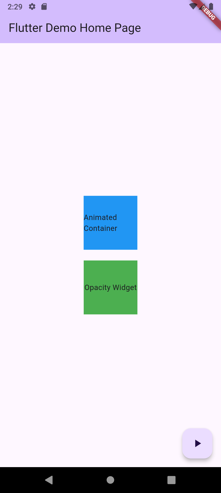
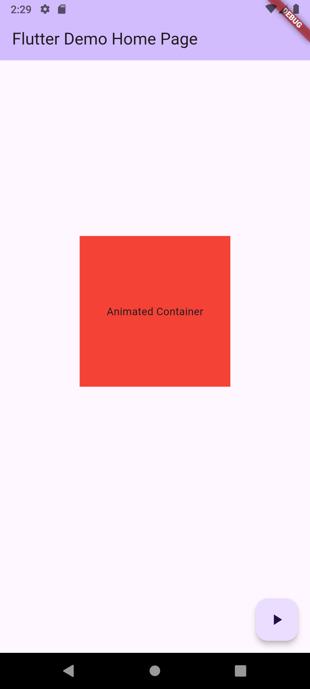

# simple_animations

A Flutter project demonstrating basic animations using `AnimatedContainer` and `AnimatedOpacity`.

## Features

This application showcases:
- **AnimatedContainer**: Changes in size, color, and alignment with a smooth transition.
- **AnimatedOpacity**: Fades an element in and out.

Both animations are triggered by a floating action button.

## Screenshot

Here's screenshots of the application:

| Screenshot | Screenshot1 |
| :---: | :---: |
|  |  |

## Getting Started

To run this project, ensure you have Flutter installed. Then:

1. Clone this repository:
   ```bash
   git clone https://github.com/your-username/simple_animations.git
   cd simple_animations
   ```
2. Get dependencies:
   ```bash
   flutter pub get
   ```
3. Run the application:
   ```bash
   flutter run
   ```

## Project Structure

- `lib/main.dart`: Contains the main application logic and UI, including the animation implementations.

## Resources

- [Lab: Write your first Flutter app](https://docs.flutter.dev/get-started/codelab)
- [Cookbook: Useful Flutter samples](https://docs.flutter.dev/cookbook)
- [Flutter online documentation](https://docs.flutter.dev/)
